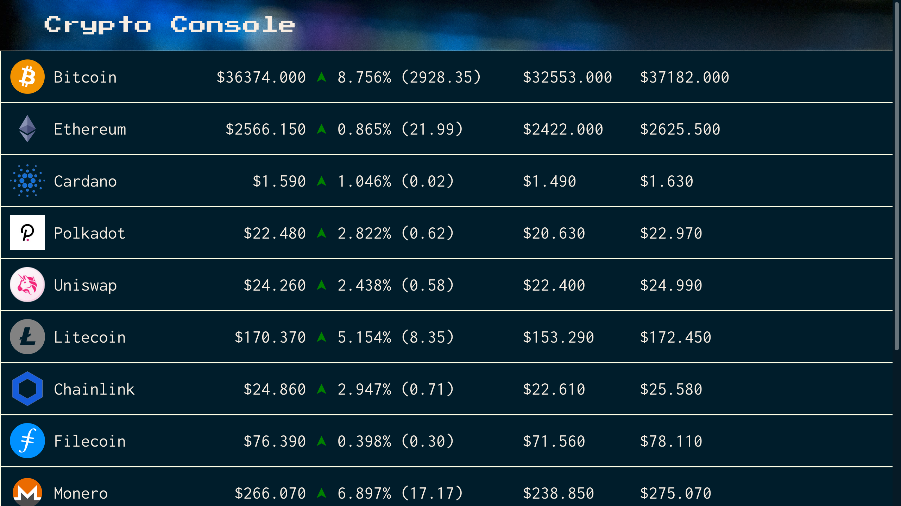

## Description

CryptoConsole is a data dashboard for the hottest cryptocurrencies.
Viewers can see current prices, price changes, market cap rank, and the price minima/maxima of the last hour.

The application opens a WebSocket connection which the server uses to continuously update the client with real-time market information.

This project is made possible by the incredible API available at [CoinGecko](https://www.coingecko.com/en).

## Stream CryptoConsole's Data

The WebSocket handler can be used as a programmatic API. If you wanted to make use of CryptoConsole's data, you could request it like this:
```bash
$ websocat "wss://cryptoconsole.site/source"
```

## Future Roadmap

In the future, CryptoConsole will likely be updated to include:
- More descriptive information on the displayed cryptocurrencies
- A larger set of cryptocurrencies to be tracked (e.g. including the Nano currency)
- The move to a stateful application where users can customize the cryptocurrencies they see

## Demo

<p align='center'>

</p>
